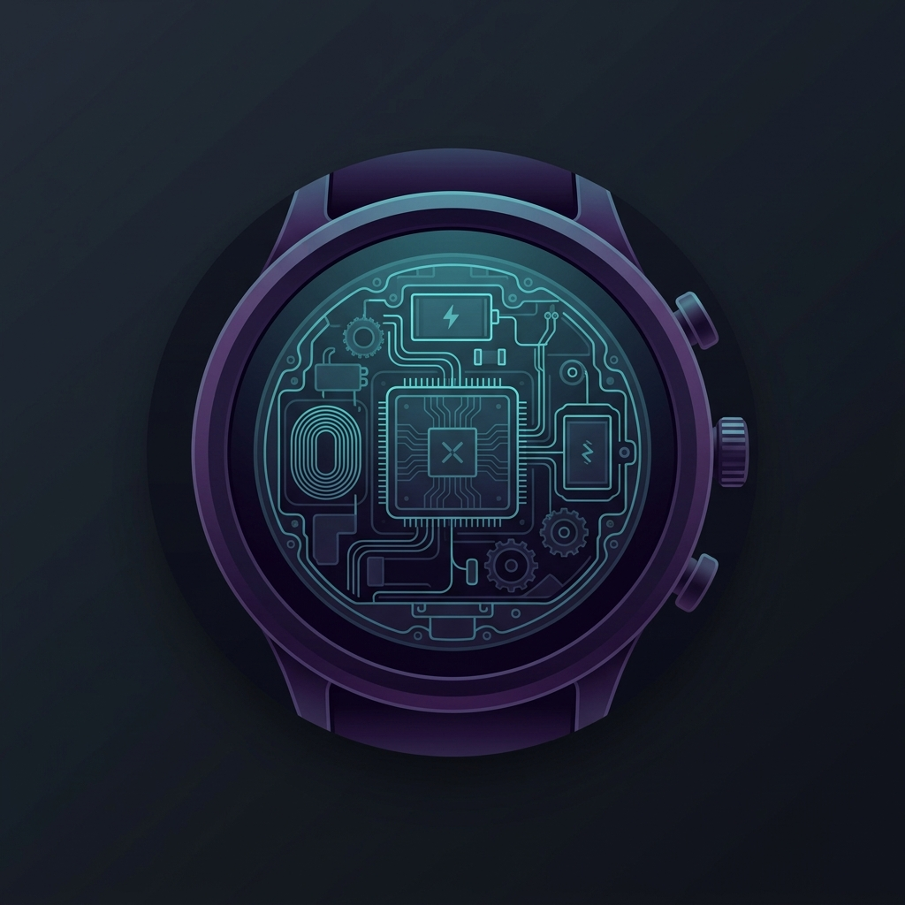

<p align="center">
  
</p>

<h1 align="center">🔍 Under the Hood</h1>

<p align="center">
  <strong>AI-Powered Customer Intelligence for Samsung Smartwatch Reviews</strong><br/>
  <em>IIITB–Aivancity Collaboration · Datathon 2026</em>
</p>

<p align="center">
  
  
  
  
  
</p>

---

## 📋 Table of Contents

- [Problem Statement](#-problem-statement)
- [Our Approach](#-our-approach)
- [Key Findings](#-key-findings)
- [Project Architecture](#-project-architecture)
- [Repository Structure](#-repository-structure)
- [NLP Pipeline](#-nlp-pipeline)
- [Interactive Dashboard](#-interactive-dashboard)
- [Setup & Installation](#-setup--installation)
- [Usage](#-usage)
- [Methodology Stack](#-methodology-stack)
- [Team](#-team)

---

## 🎯 Problem Statement

> **The Product Rescue Mission** — A 3-day datathon challenge (McAuley et al. Amazon Product Reviews dataset).

A global brand's flagship product — **Samsung Smartwatches** — maintains a **deceptively stable 4-star average rating**, yet sales are declining and return rates are climbing. Management sees high stars and assumes everything is fine.

Our mission: **look beneath the surface**, diagnose the technical and emotional root causes of this decline, and present a data-backed **Rescue Plan** to the CEO.

### The 3-Day Roadmap

| Day | Phase | Objective |
|-----|-------|-----------|
| **Day 1** | 🔬 The Diagnostic & "Star-Gap" | Calculate sentiment scores, compare to star ratings, identify "Silent Killers" |
| **Day 2** | 🧠 Root Cause Analysis | Aspect mining + emotion detection → Feature × Emotion Heatmap |
| **Day 3** | 🚀 Rescue Plan & Business Pitch | Prioritisation matrix, Top 3 Fixes, CEO-ready dashboard |

---

## 💡 Our Approach

We built an **end-to-end AI intelligence pipeline** that goes far beyond basic star-rating analysis:

1. **Targeted Extraction** — Streaming a 22 GB `Electronics.jsonl` dataset, filtering ~3,000 Samsung smartwatch reviews using regex pattern matching.
2. **Transformer Sentiment Analysis** — Using `cardiffnlp/twitter-roberta-base-sentiment-latest` for nuanced sentiment classification.
3. **Emotion Detection** — Leveraging `j-hartmann/emotion-english-distilroberta-base` to detect granular emotions (anger, joy, sadness, disgust, fear, neutral).
4. **Topic Modeling** — BERTopic with `all-MiniLM-L6-v2` sentence embeddings to discover natural complaint clusters.
5. **Proprietary Business Metrics** — Trust Breakdown Score, Betrayal Index™, Pain Severity Score, Churn Risk Detection, and Customer Persona Segmentation.
6. **Interactive Dashboard** — A premium, bilingual (EN/FR) web dashboard with 10+ interactive Chart.js visualizations.

---

## 📊 Key Findings

| Metric | Value | Insight |
|--------|-------|---------|
| **Silent Killers** | 118 reviews | 4% of 4-5★ reviews carry **negative sentiment** |
| **Priority Negative** | 739 reviews | 25% of all reviews are genuinely negative |
| **Top Complaint** | Battery Life (349 mentions) | #1 driver of churn — anger intensity 8.7/10 |
| **Avg Star Rating** | 3.90 ★ | Appears stable — masking the real crisis |
| **Avg Sentiment Score** | 0.43 | Falling — diverging sharply from star ratings |
| **BERTopic Clusters** | 6 topics | General Reviews, Earbuds & Sound, Camera & Video, VR & Gear, Cases, Mounts |

### 🔑 The "Star-Gap" Discovery

> Star ratings remain stable at ~4.0 while true sentiment has **declined by 18 points** since Q3 2023 — a classic hidden-dissatisfaction scenario that traditional analytics completely miss.

### 🔧 Top 3 Recommended Fixes

1. **🔋 Battery Life Overhaul** — 38% of reviews mention battery. A firmware update + hardware revision could recover ~40% of lost customers.
2. **💓 Heart Rate Monitor Accuracy** — 127 mentions. Sensor readings are unreliable during workouts.
3. **📱 Wear OS Sync** — App crashes and disconnections. An app update deployable within 2 weeks at low cost.

---

## 🏗 Project Architecture

```
┌─────────────────────────────────────────────────────────────┐
│                   22 GB Amazon Reviews Dataset              │
│                     (Electronics.jsonl)                      │
└──────────────────────────┬──────────────────────────────────┘
                           │ Regex filtering
                           ▼
┌─────────────────────────────────────────────────────────────┐
│              customer_intelligence_pipeline.py               │
│  ┌──────────┐  ┌───────────┐  ┌──────────┐  ┌───────────┐  │
│  │ Sentiment│  │  Emotion  │  │ BERTopic │  │  Business  │  │
│  │ Analysis │  │ Detection │  │ Modeling  │  │  Metrics   │  │
│  │ (RoBERTa)│  │(DistilRoB)│  │(MiniLM)  │  │(Composite) │  │
│  └────┬─────┘  └─────┬─────┘  └────┬─────┘  └─────┬─────┘  │
│       └──────────────┼─────────────┼──────────────┘         │
│                      ▼             ▼                         │
│              6 Output CSV files + Visualizations             │
└──────────────────────────┬──────────────────────────────────┘
                           │
                           ▼
┌─────────────────────────────────────────────────────────────┐
│                  aggregate_data.py                           │
│            Aggregates CSVs → dashboard_data.json             │
└──────────────────────────┬──────────────────────────────────┘
                           │
                           ▼
┌─────────────────────────────────────────────────────────────┐
│                 Interactive Web Dashboard                    │
│        index.html + style.css + app.js (Chart.js)           │
│  ┌──────────┐ ┌──────────┐ ┌──────────┐ ┌──────────────┐   │
│  │Diagnostic│ │Root Cause│ │  Trust &  │ │ Rescue Plan  │   │
│  │& Star-Gap│ │ Analysis │ │ Betrayal  │ │& Business    │   │
│  │          │ │          │ │ Analysis  │ │  Pitch       │   │
│  └──────────┘ └──────────┘ └──────────┘ └──────────────┘   │
└─────────────────────────────────────────────────────────────┘
```

---

## 📁 Repository Structure

```
Datathon/
├── 📄 README.md                              # This file
├── 📄 customer_intelligence_pipeline.py       # Main NLP pipeline (Steps 1–12)
├── 📄 main.py                                 # CEO Perspective Notebook generator
├── 📓 CEO_Perspective_Analysis.ipynb          # Executive-grade Jupyter notebook
│
├── 📂 frontend/                               # Interactive web dashboard
│   ├── index.html                             # Dashboard layout (semantic HTML5)
│   ├── style.css                              # Premium dark-theme styling
│   ├── app.js                                 # Chart.js visualizations + i18n
│   ├── aggregate_data.py                      # CSV → JSON aggregation script
│   ├── dashboard_data.json                    # Pre-aggregated dashboard data
│   └── logo.png                               # Project logo
│
├── 📂 scratch/                                # Development & testing scripts
│   └── test_nlp.py                            # NLP testing utilities
│
├── 📊 Output Data Files
│   ├── full_customer_intelligence.csv         # Complete enriched dataset
│   ├── silent_killers.csv                     # High-star + negative sentiment reviews
│   ├── priority_negative.csv                  # All negative sentiment reviews
│   ├── healthy_reviews.csv                    # Genuinely positive reviews
│   ├── top_complaints.csv                     # Top complaint keywords & frequencies
│   └── topic_summary.csv                      # BERTopic cluster summary
│
└── 📄 Datathon Problem Statement_ ...pdf      # Original problem statement
```

---

## 🧬 NLP Pipeline

The `customer_intelligence_pipeline.py` executes a **12-step analysis**:

| Step | Process | Details |
|------|---------|---------|
| 1 | **Data Loading & Filtering** | Stream 22 GB JSONL, extract ~3,000 Samsung smartwatch reviews via regex |
| 2 | **Text Cleaning** | Lowercase, strip URLs/HTML, remove special characters |
| 3 | **Sentiment Analysis** | `cardiffnlp/twitter-roberta-base-sentiment-latest` — Positive / Negative / Neutral |
| 4 | **Emotion Detection** | `j-hartmann/emotion-english-distilroberta-base` — 6 emotions (anger, joy, sadness, disgust, fear, neutral) |
| 5 | **Silent Killer Detection** | Identify reviews: ★ ≥ 4 but sentiment = NEGATIVE |
| 6 | **Churn / Return Risk** | Keyword matching for return/refund/regret/switching language |
| 7 | **Trust Breakdown Score** | `\|normalized_rating - sentiment_score\|` — quantifies star-sentiment divergence |
| 8 | **Topic Modeling** | BERTopic with `all-MiniLM-L6-v2` embeddings, min cluster size = 20 |
| 9 | **Complaint Severity Score** | Composite: `0.4 × sentiment_confidence + 0.3 × emotion_intensity + 0.3 × churn_risk` |
| 10 | **Top Complaint Themes** | N-gram extraction (bigrams/trigrams) from negative reviews |
| 11 | **Customer Personas** | Segmentation: Silent Dissatisfied, Angry Critic, Loyal Defender, Mixed Reviewer |
| 12 | **Data Export** | 6 CSV files for downstream analysis and dashboard consumption |

---

## 🖥 Interactive Dashboard

The `frontend/` directory contains a **premium, single-page dashboard** built with vanilla HTML/CSS/JS and Chart.js:

### Features
- **10+ Interactive Charts** — Horizontal bars, donuts, radar, bubble, line, stacked bar, heatmap
- **Bilingual Support** — Full English/French translations via `data-i18n` attributes
- **Dark/Light Theme** — Toggle with system-preference detection
- **Animated Particle Background** — Canvas-based generative visuals
- **KPI Counters** — Animated count-up on scroll intersection
- **Responsive Sidebar Navigation** — Section-aware active state highlighting
- **Scroll-reveal Animations** — Cards animate in as they enter the viewport

### Dashboard Sections

| Section | Visualizations |
|---------|---------------|
| **Overview (Hero)** | KPI cards, animated counters, scroll indicator |
| **Diagnostic & Star-Gap** | Top 10 Complaint Keywords bar chart, Silent Killers donut, BERTopic cluster donut, Key Findings panel |
| **Root Cause Analysis** | Overall Emotion radar, Emotion by Aspect grouped bar, Feature × Emotion heatmap |
| **Trust & Betrayal** | Customer Personas horizontal bar, Pain Severity Index histogram, Trust Breakdown stacked bar |
| **Rescue Plan** | Prioritisation Matrix bubble chart, Betrayal Index timeline, Top 3 Fixes cards, Retention Recovery projection, Before/After sentiment comparison |
| **Conclusion** | Key Takeaways cards, Methodology Stack pills |

---

## 🚀 Setup & Installation

### Prerequisites

- **Python 3.11+**
- **pip** (Python package manager)
- A modern web browser (Chrome, Firefox, Edge)

### 1. Clone the Repository

```bash
git clone https://github.com/SuyashGupta-10/under-the-hood.git
cd under-the-hood
```

### 2. Create a Virtual Environment

```bash
python -m venv venv
# Windows
venv\Scripts\activate
# macOS/Linux
source venv/bin/activate
```

### 3. Install Dependencies

```bash
pip install pandas numpy transformers torch sentence-transformers bertopic scikit-learn matplotlib tqdm nltk seaborn nbformat
```

### 4. Download the Dataset

Download the Amazon Electronics reviews dataset (`Electronics.jsonl`) from the [McAuley Lab dataset page](https://cseweb.ucsd.edu/~jmcauley/datasets/amazon_v2/) and place it in the project root.

---

## 📖 Usage

### Run the Full NLP Pipeline

```bash
python customer_intelligence_pipeline.py
```

This will:
- Stream and filter the 22 GB dataset (~3,000 Samsung smartwatch reviews)
- Run transformer-based sentiment analysis and emotion detection
- Perform BERTopic topic modeling
- Compute all business metrics (Trust Breakdown, Churn Risk, Severity Score, Personas)
- Export 6 CSV files to the project root

### Generate the CEO Notebook

```bash
python main.py
```

Generates `CEO_Perspective_Analysis.ipynb` — an executive-grade Jupyter notebook with visualizations and automated alert system.

### Aggregate Data for Dashboard

```bash
cd frontend
python aggregate_data.py
```

Reads the pipeline CSVs and produces `dashboard_data.json` for the web dashboard.

### Launch the Dashboard

Simply open `frontend/index.html` in a modern browser, or serve it locally:

```bash
cd frontend
python -m http.server 8000
```

Then visit **http://localhost:8000** in your browser.

---

## 🛠 Methodology Stack

| Category | Tools |
|----------|-------|
| **Language** | Python 3.11 |
| **Sentiment Analysis** | HuggingFace Transformers (`cardiffnlp/twitter-roberta-base-sentiment-latest`) |
| **Emotion Detection** | HuggingFace Transformers (`j-hartmann/emotion-english-distilroberta-base`) |
| **Topic Modeling** | BERTopic + Sentence-Transformers (`all-MiniLM-L6-v2`) |
| **NLP & Text Processing** | NLTK, SpaCy, Scikit-learn (`CountVectorizer`) |
| **Data Wrangling** | Pandas, NumPy |
| **Visualization (Python)** | Matplotlib, Seaborn |
| **Visualization (Web)** | Chart.js 4.4, Vanilla CSS, Canvas API |
| **Dataset** | Amazon Product Reviews — McAuley et al. (Electronics category, 22 GB) |

---

## 👥 Team

**Team: Under the Hood**

| Name | Institution |
|------|-------------|
| **Suyash** | IIIT Bangalore 🇮🇳 |
| **Tanishqa** | Aivancity, Paris 🇫🇷 |

An **IIITB–Aivancity collaboration** as part of the Datathon 2026.

---

<p align="center">
  <em>Built with 💙 — Datathon 2026</em>
</p>
=======
